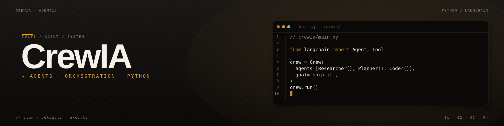

<div align="center">



# CrewAI Agents — Équipes d'IA 100 % locales

### *3 crews d'agents spécialisés qui collaborent pour résoudre des tâches concrètes — contenu, e-commerce, détection de produits winners. Aucune donnée ne sort de la machine.*


</div>

---

## Aperçu

Trois **équipes d'agents IA** (*crews*) bâties avec **[CrewAI](https://docs.crewai.com/)** + **[Ollama](https://ollama.com/)** — chaque crew orchestre **4 agents** aux rôles complémentaires qui se passent le relais pour produire un livrable exploitable.

> **100 % local, 100 % gratuit.** Aucune clé API OpenAI / Anthropic requise. Les modèles tournent sur votre machine (Mistral 7B recommandé).

---

## Démonstration

<!-- TODO: ajouter un GIF d'une exécution + capture des 4 agents en train de collaborer -->

**Exemple de sortie — Crew 1 (Usine à Contenu) :**

```
OK Agent Chercheur   → analyse du sujet, 3 angles trouvés
OK Agent Rédacteur   → article 1 050 mots généré
OK Agent Social      → post IG (120 mots) + post LI + thread X (3 tweets)
OK Agent SEO         → titre, méta, 12 mots-clés, structure H1/H2/H3

→ contenu_20260415_1422.txt  (tout le livrable en un fichier)
```

---

## Les 3 crews

### 1 SocialMedia — Usine à contenu

> *Un sujet, un public cible → article de blog + posts IG / LinkedIn / Twitter + rapport SEO.*

**[→ Voir le README détaillé](./SocialMedia/README.md)**

| Agent | Rôle |
|-------|------|
| Chercheur | Analyse le sujet, trouve les angles |
| Rédacteur | Rédige l'article de blog structuré |
| Social Media | Adapte pour IG / LI / Twitter |
| SEO Expert | Optimise pour Google |

---

### 2 E-commerce / ProductAssistant — Assistant fiches produits

> *Une fiche produit + avis clients → fiche réécrite + stratégie prix + réponses aux avis.*

**[→ Voir le README détaillé](./E-commerce/ProductAssistant/README.md)**

| Agent | Rôle |
|-------|------|
| Analyste Produit | Évalue & score la fiche actuelle |
| Rédacteur Produit | Réécrit pour convertir |
| Gestionnaire Prix | Bundles, promos, stratégie |
| Gestionnaire Avis | Réponses clients pros |

---

### 3 E-commerce / WinnerFinder — Détecteur de produits winners

> *Une niche, un budget → 5 produits tendance + TOP 3 + plan sourcing + plan de lancement 30 jours.*

**[→ Voir le README détaillé](./E-commerce/WinnerFinder/README.md)**

| Agent | Rôle |
|-------|------|
| Chasseur de Tendances | Détecte les produits qui montent |
| Analyste de Marché | Score et classe |
| Expert Sourcing | Fournisseurs + calcul de marges |
| Stratège Lancement | Plan marketing 30 jours |

> **Option recherche web réelle** : brancher une clé [Serper](https://serper.dev) (2 500 recherches/mois gratuites) pour passer de "connaissance du modèle" à "données Google en temps réel".

---

## Installation (une seule fois)

```bash
# 1. Installer Ollama
curl -fsSL https://ollama.com/install.sh | sh

# 2. Télécharger un modèle
ollama pull mistral              # meilleur pour le français
# ou
ollama pull qwen2.5-coder:7b     # meilleur pour le code

# 3. Dépendances Python
pip install crewai crewai-tools langchain-community requests beautifulsoup4
```

---

## Lancer un crew

```bash
# Crew 1 — Usine à Contenu
cd SocialMedia
python ContentCrew.py

# Crew 2 — Assistant E-commerce
cd E-commerce/ProductAssistant
python ProductAssistant.py

# Crew 3 — Winner Finder
cd E-commerce/WinnerFinder
export SERPER_API_KEY="votre_cle"    # optionnel mais recommandé
python WinnerFinder.py
```

Chaque script produit un fichier `.txt` horodaté avec l'intégralité du livrable.

---

## Structure

```
CrewAI/
├── SocialMedia/
│   ├── ContentCrew.py          ← orchestration des 4 agents
│   └── README.md
└── E-commerce/
    ├── ProductAssistant/
    │   ├── ProductAssistant.py
    │   └── README.md
    └── WinnerFinder/
        ├── WinnerFinder.py
        └── README.md
```

---

## Architecture d'un crew

Un crew CrewAI = **4 éléments** :

1. **Agents** — chacun a un rôle (`role`), un objectif (`goal`), un backstory (`backstory`), et un LLM
2. **Tasks** — chaque tâche a une description, un `expected_output`, et est assignée à un agent
3. **Crew** — l'orchestrateur qui séquence les tâches (mode `sequential` par défaut)
4. **Tools** *(optionnel)* — scraping, recherche web, calcul…

Dans tous les crews ici, le mode est **séquentiel** : chaque agent enrichit le résultat de l'agent précédent, comme un pipeline.

```
[Agent 1] → [Agent 2] → [Agent 3] → [Agent 4] → fichier .txt
```

---

## Performances (iMac 2013, 32 GB RAM)

| Crew | Temps moyen | Modèle |
|------|-------------|--------|
| SocialMedia | 5–10 min | `mistral` |
| ProductAssistant | 8–15 min | `mistral` |
| WinnerFinder (sans Serper) | ~10 min | `mistral` |
| WinnerFinder (avec Serper) | 15–20 min | `mistral` |

---

## Dépannage

**`Connection refused`** → Ollama n'est pas lancé

```bash
ollama serve
```

**`Model not found`** → le modèle n'est pas téléchargé

```bash
ollama pull mistral
```

**Génération trop lente** → réduire la longueur demandée dans les tâches ou utiliser un modèle plus petit (`ollama pull phi3`).

---

## Roadmap

- [ ] **Crew 4** — Analyste CV / matching d'offres d'emploi (en lien avec [intern-bot](https://github.com/XI-X-IX/intern-bot))
- [ ] Passer l'orchestration en **mode hiérarchique** (un agent manager qui supervise)
- [ ] Ajouter un **outil de scraping web** propre (respect des `robots.txt`)
- [ ] **Mémoire persistante** entre sessions (chroma / sqlite)
- [ ] Interface **Streamlit** pour lancer les crews sans ligne de commande
- [ ] Export en **Markdown / PDF** au lieu de `.txt` brut
- [ ] Conteneurisation **Docker** (Ollama + crews)

---

## Ce que j'ai appris

- **Orchestration multi-agent** — découper un problème complexe en sous-tâches atomiques assignées à des rôles spécialisés
- **Prompt engineering structuré** — `role` + `goal` + `backstory` + `expected_output` donnent des résultats 10× plus fiables qu'un prompt libre
- **LLM local** — Ollama rend les modèles 7B utilisables sur une machine modeste ; trade-off vitesse vs confidentialité
- **Pipeline séquentiel vs hiérarchique** — quand l'un est plus adapté que l'autre
- **Coût zéro** — tout le stack est open-source / gratuit ; intéressant pour des use cases où les données ne peuvent pas quitter l'entreprise
- **Limites des LLM 7B** — ils hallucinent, il faut toujours ancrer les sorties avec des outils de recherche ou de vérification

---

## Licence

<!-- TODO: MIT — voir [`LICENSE`](./LICENSE) *(à ajouter)* -->

Projet personnel d'exploration de CrewAI et des architectures multi-agents locales.
